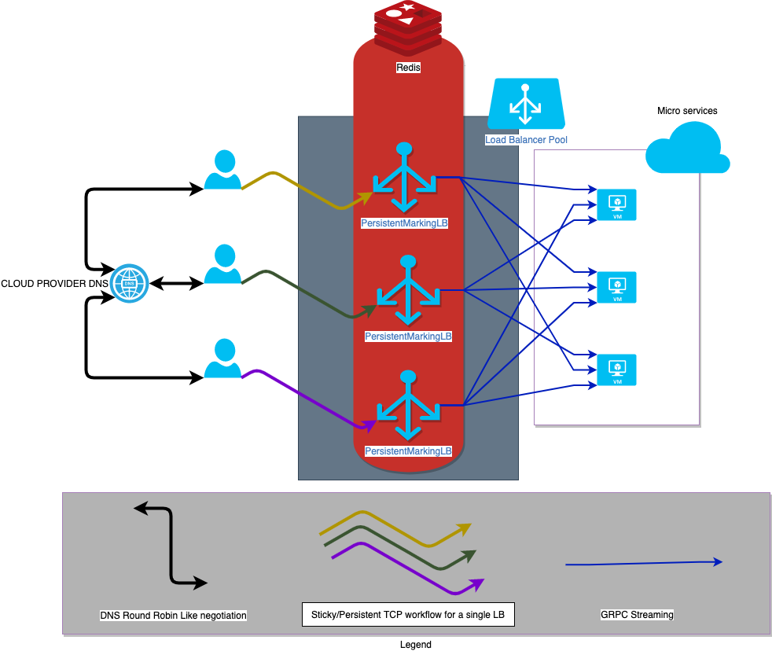

# persistent_marking_lb
Give us some long lived TCP stuffs, and we'll mark it for you !

Sometimes when real apps with long lived connection like TCP needs to connect
 to upstream servers.
 
Lot of back end servers are dealing with raw TCP long lived connections in
order to manage their clients and to identify them, however in the case
where we would like to have this uniquily idenfitied connections to go over
multiples stateless instance of the same back end servers, they would like
to identify all clients by a unique way (maybe a kind of identified).
    
To do that, most of clients have to change their implementations by adding
some custom metadata in their flowing frames or by using a sticky load
balancer which will keep a context for each incoming client.

We aim to support these features:

- Service Discovery (what are my upstreams servers)
- Health checking (How are my upstream servers)
- Load balancing (distribute equally stuffs)

## What for ?

You would like to multiplex your raw TCP connections which are long lived by
keep their context as a unique identifier and upstream them to your back-end
servers to keep the context and belongs to their original data, finally
all of them served with GRPC ! 

## Limits

Our component is not bind to any distribution or hardware specs, that's we take a
position as a `proxy-as-a-service`, in the case where all TCP connections are bound
to the end entity by some strong networking constraints(aka what CARP
& VRRP do), we do not offer a port of tcp connection/sockets between our load
balancers, once a connection is established with the a load balancer, it
will exist during the whole lifetime of the socket itself. 

Thus this load balancer is not aimed to be used as a completely stateless
component but much more as a bridge between raw TCP sockets,
tagging them and finally multiplexing them to upstreams servers.  

## Recommendations

By the concept of this tool & by limitations of underlying networking concerns
we recommend to add a `Round-Robin DNS` like mechanism in the front of this
/these load(s) balancer(s), our main concerns is we would like to avoid VRRP
/CARP protocols and let external networking mechanism to handle load balancers.
Our main goal is to bring actual tools & technologies, to tie them and give a
simple solution.
 
 ## Architecture overview
 
 
 

# **Development workflows**

## Start the upstream peer with supported GRPC protocol

For development purposes, it's much better to have another peer which will respond
to our messages, by sending a dummy message !

To start the GRPC server:
``sh
cd misc/grpc && sh start_stub_server.sh
``

This is a docker container with the port `4770` open, which we'll use to call it from our runtime.

