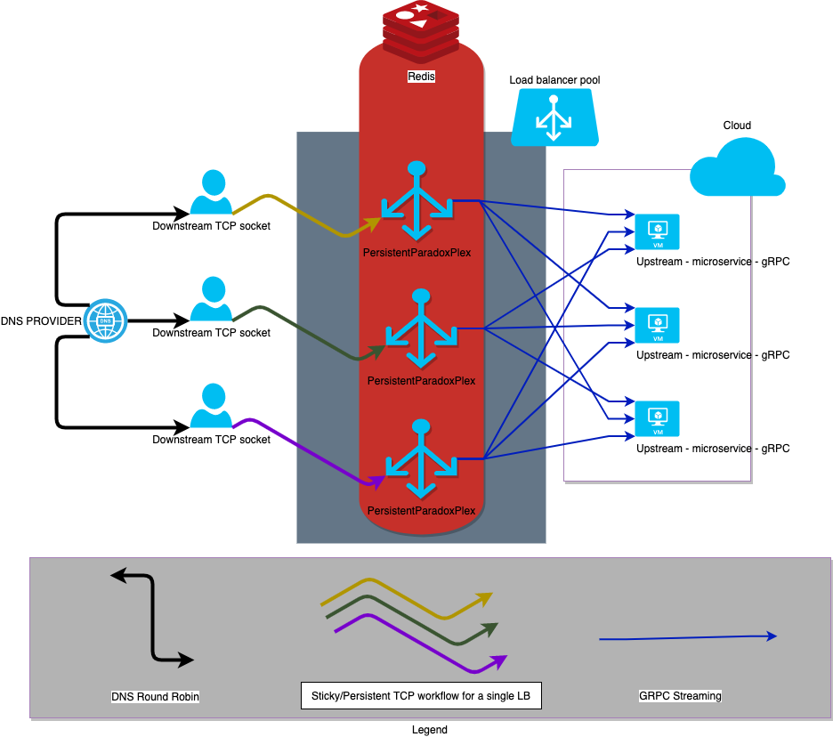

# PersistentParadoxPlex !

A simple but powerful TCP load balancer demultiplexing to GRPC peers ! Free yourself from big monolithic apps which are required because of the stateful side of the TCP, we got it for you.

---

## Introduction

Conceptually speaking, TCP has been of the favourite transport protocol (L4 in the OSI) once we're talking about resiliency and integrity of the data from end-to-end pipes. These connections are long-lived and usually bi-directional which able send lot of data through these pipes, however they embody few cons:

- Can't tranfert dynamically the socket to another entity which will handle it
- Can't scale out infinitely (pure TCP sockets does not mix well with microservices) => eg. the Cloud
- Old monolithic apps which contains business heuristics are not built to handle a lot of I/O & Networking stuffs when they have been built at the day 0

---

**Transfert dynamically the TCP socket ?**

> Due to the constraints of what TCP offers, it looks not trivial or even nearly impossible to pass around sockets by sending them to others "entities" to handle them, this is a fact and we must to find a workaround to use it as a strength and meet market's ecosystem.

**Scaling out with pure TCP stuffs**

> Most of the time, people who are using pure TCP sockets are identifiying them in their front-end "big" monolithic app and handle from scratch all the life cycles. At the departure of these apps, I/O & Networking stuffs were not the first goals to achieve and deal with, but over the time, it gone like this and ended up to be the bottleneck of the whole system. Of course it would be possible to have multiple instances of these big monolithic apps but usually they tends to not work together and very hard to scale out over a network.

**Old/Monolithic apps & I/O stuffs (eg. Networking)**

> Leaving aside where all business heuristics/code are contained by these old and big monolithic apps, they tends to not be enough robust, resilient and finally performant when we're talking about I/O networking stuffs, most of the case because the languages and the framework was not aimed conceptually speaking to handle too much operations, and/or sometimes used frameworks were too buggy and not enough good for these kind of stuffs.

What we are bringing here will not change by magic all of these issues but will tackle them one by one according to how much effort users will put into the table. The main purpose is to change/improve whole system to be resilient & highly available, what we strongly believe is to users to draw out their capital gains by using their apps the right way eg. the business heuristic/codes. That's what really matters.

PersistentParadoxPlex is aimed to bring more flexibility and empower these old business apps by doing:

- Identification of TCP sockets by using unique metadata
- Efficiently handle the lifecycle of all TCP sockets
- Demultiplex TCP sockets to upstreams microservices to pull out all benefits of your business/heuristics
- Scale out your upstream servers to the infinite without worrying too much about downstream TCP sockets !
- Keep your heuristics of your old business code by having the same real-time abstraction thanks to gRPC protocol

## TLDR?

- Would you like demultiplex your raw incoming TCP sockets to the infinity ?
- Would you like to somebody to keep them alive and identify them for you ?
- Would you like to split your big monolithic app and use them as microservices to scale out in the infinite (eg. the CLOUD) ?
- Would you like to be still efficient and keep high resilient and performance via gRPC connections ?

**Then here you go, say hello to PersistentParadoxPlex !**

---

## Architecture overview



---

## Features

- Demultplexing of TCP sockets
- Identification and handle of lifecycle for TCP sockets
- Unique UUID generated TCP sockets
- gRPC for upstreams clients (eg. the Cloud/K8S)
- Fair distribution of downstream peers (TCP sockets) via Round Robin like heuristics
- Broadcast to all/active/inactive downstream peers
- Ready checks of upstream peers
- Live checks of upstream peers
- Dynamic control of upstream peers (for administrative purposes via HTTP req)
- Dynamic control of downstream peers (for administrative purposes via HTTP req)
- Dynamic runtime control (TODO) via HTTP req
- Easily use multiple languages thanks by Google protobuf
- High performance & resiliency (Rust language)

---

## Limits

Our component is not bind to any distribution or hardware specs, that's we take a
position as a `proxy-as-a-service`.
For cases where all TCP connections are bound to the load balancer by some strong networking constraints(aka what CARP & VRRP do), we do not offer a portability of tcp sockets between our load balancers, once a connection is established with the a load balancer, it will exist during the whole lifetime of the socket itself.

Thus this load balancer is not aimed to be used as a completely stateless component but much more as a demultiplexer between pure TCP sockets and stateless microservices usually backed by some high performance database (Redis & co).

---

## Recommendations

In the case where this project is aimed to use as multiple instances, we recommend to add a `Round-Robin DNS` like mechanism in the front of this /these load(s) balancer(s), our main concerns is we would like to avoid VRRP /CARP protocols and let external networking mechanism to handle load balancers.

If the goal behind is to replace a big monolithic app (completely stateful) where all synchronisation where have to happen, you'll have no choice to add an entity which will do synchronisation for you, eg. database like redis, mainly because of transactions between these TCP sockets and do not forget: it might happen that 10 requests from the same downstream peer (TCP socket) might not be received by the same upstream peer (gRPC instance) this is where all synchronisation stuff happens.

---

## Prerequisites

- Rust : rustc 1.48.0-nightly (build)
- Protoc for generation of protofile (for upstream peers eg. microservices)
- Docker if used as a container

---

## Build

```sh
cargo build
```

---

## Usage

Implement/Use with the language of your choice the Google Protobuf residing in `misc/grpc/proto/upstream.proto`, start it as a server.

---

Start the server (TRACE mode):

> In your localhost

```sh
RUST_LOG=trace cargo run
```

> By using the Docker container

```sh
docker run -p 7999:7999
```

NOTE: be careful to correctly use Docker network for upstream hosts resolution (example for Mac <https://docs.docker.com/docker-for-mac/networking/>)

Connect your downstream TCP sockets/clients to the runtime

```sh
nc 127.0.0.1 7999
```

Enjoy !

---

## TODO

- SHOULD SHARE THE WHOLE CONTEXT THROUGH REDIS IN ORDER TO HAVE N GRPC CONNECTIONS ON EACH UPSTREAM PEERS

---

## Contact

_sergen[dot]tanguc[at]gmail[dot]com_

---

## Benchmark

Soon

---

## Acknowledgements

Thanks to the following team members for various answers:

- Tokio
- Tonic
- Prost
- Rust (discord channel)

---

## Contributing

Pull requests are welcome. For major changes, please open an issue first to discuss what you would like to change.

Please make sure to update tests as appropriate.

### Start the upstream peer with supported GRPC protocol

For development purposes, it's much better to have another peer which will respond
to our messages, by sending a dummy message !

For the sake of simplicity we recommend to use the following:
<https://github.com/tanguc/golang-grpc-server>

Make sure to have Golang installed in your host.

To start the GRPC server:
`sh go run main.go --port YOUR_PORT_NUMBER`

### How to change the protobuf file for revisions/improves ?

Protobuf's output is generated inside the sub project called `proto_gen` which is a simple cargo project which will generated Rust server/clients files from the defined protobuf file.

```bash
./generate_rs_from_proto.sh && cargo build
```

You have now the newly generated Rust file with your revisions !

---

## License

[GPLv3](https://www.gnu.org/licenses/gpl-3.0.en.html)

---
